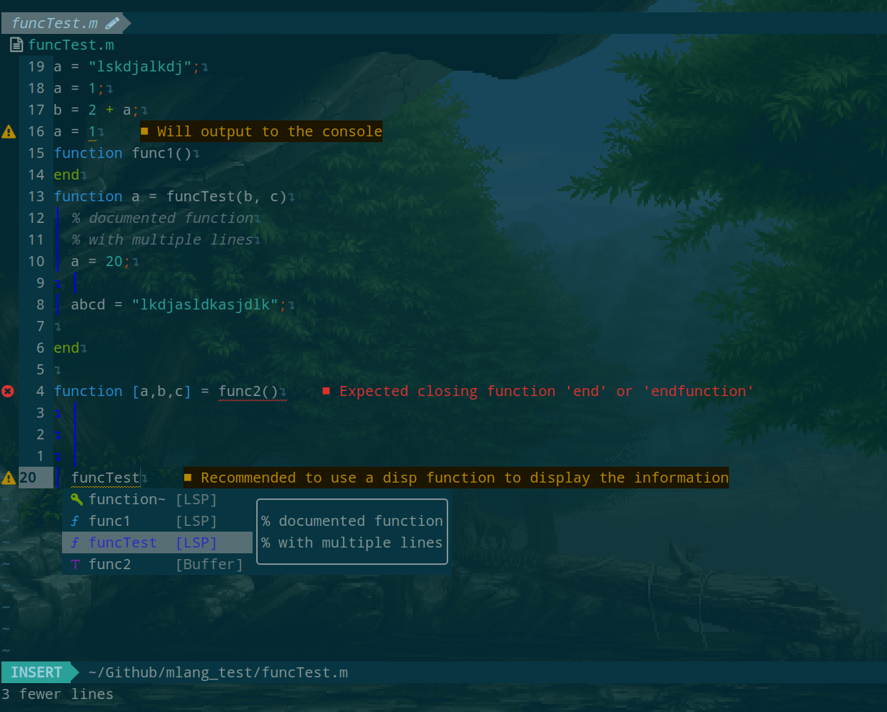

# mlang (LSP for Octave)

This is an implementation of the [Language Server Protocol](https://code.visualstudio.com/api/language-extensions/language-server-extension-guide) for the [Octave](https://octave.org/) programming language.

## Screenshots



## Technologies

- [Typescript](https://www.typescriptlang.org/)
- [esbuild](https://esbuild.github.io/)
- [vscode-languageserver](https://www.npmjs.com/package/vscode-languageserver) _(LSP official node package)_

## Working features

<!-- - Completion _(some keywords, some native functions, user defined functions and files)_ -->
<!-- - goToDefinition _(for user defined functions and files)_ -->
- goToReference _(still some that are not getting recognized)_
<!-- - diagnostics _(closing tags, redefined functions, missing imports, typing errors)_ -->

## How to setup in the client

### Neovim (lua)

```lua
local lspconfig = require("lspconfig")
local lspconfig_config = require("lspconfig.configs")
-- mlang
if not lspconfig_config.mlang then
local mlang_server = "path/to/server.js"
lspconfig_config.mlang = {
    default_config = {
        name = "mlang",
        cmd = { "node", mlang_server, "--stdio" },
        filetypes = { "matlab", "octave", "m" },
        root_dir = function()
            return vim.fn.getcwd()
            end,
        settings = {
            settings = {
                maxNumberOfProblems = 1000,
            },
        },
    },
}
end
```

## TODO

- [ ] Maybe consider documentation with comments on variable as well.


<!-- ## How to contribute? -->

<!-- Clone the repository and install the node dependencies with `$ yarn`. Then modify the files in the _"src"_ folder. After you should be able to compile the server with `$ yarn compile` -->
<!-- Also consider running `$ yarn watch` to compile after every change you make. -->

### _Reference_ or _Keyword_ not found

If a reference or a keyword it's not found and it should because it's defined by default by the language you simply add it in _'./src/data/completionData.ts'_ if it's a **function**, if it's a **keyword** _'./src/parser/grammar.ts'_ in `COMMON_GRAMMAR`

## Contributors

- [Tomás Vidal](https://github.com/TomiVidal99)
